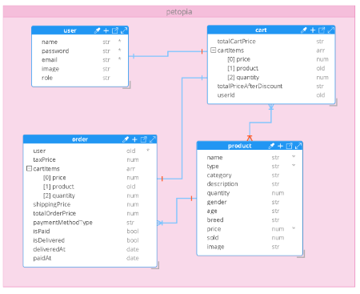

# Welcome to Petopia!

Welcome to Petopia, where you can discover your ideal furry friend and give them a loving home! Petopia is a web application powered by React.js and Node.js that allows users to browse, connect, and adopt pets in need. Whether you're looking for a playful puppy, a cuddly kitten, or a loyal companion, Petopia has you covered.

## Installation Instructions
1. Clone this repository to your local machine.
2. Navigate to the project directory.
3. Install dependencies for both the client and server:
    ```bash
    cd mainapplication
    npm install
    cd ../backnode
    npm install
    ```

4. Set up environment variables:
    - Create a `.env` file in the `backNode` directory.
    - Define environment variables such as `PORT`, `DATABASE_URL`, `JWT_SECRET`, etc.

5. Start the development servers:
    - In the `mainapplication` directory: `npm start`
    - In the `backNode` directory: `npm run dev`

## Usage Guidelines
- Visit the Petopia website to start browsing available pets.
- Create an account or log in securely to access additional features.
- Browse through the catalog of pets, view their details, and connect with them.
- Add your favorite pets to your cart and proceed to checkout to give them a forever home.
- Manage your orders, view past purchases, and update order statuses as needed.
- Leave reviews and ratings for pets you've adopted to help others make informed decisions.
- Stay updated with promotions, discounts, and new arrivals to find your perfect match.

## Additional Information
- For support or inquiries, contact our team at farahmoataz90@gmail.com.
- Follow us on social media for updates and adorable pet stories:
    - [Facebook](https://www.facebook.com/farah.moataz1/)
 

## Petopia Model Diagram




## Requirements Documentation

### API Routes

#### Authentication Routes

**POST /api/v1/signup**

- Registers a new user.
- Parameters: None
- Headers: None
- Request Body Sample:
    ```json
    {
      "name": "John Doe",
      "email": "john@example.com",
      "password": "password123"
    }
    ```

- Response Sample:
    ```json
    {
      "status": "success",
      "token": "eyJhbGciOiJIUzI1NiIsInR5cCI6IkpXVCJ9...",
      "data": {
        "user": {
          "_id": "60983d60242cc9a42c7c823d",
          "name": "John Doe",
          "email": "john@example.com",
          ...
        }
      }
    }
    ```

**POST /api/v1/login**

- Logs in an existing user.
- Parameters: None
- Headers: None
- Request Body Sample:
    ```json
    {
      "email": "john@example.com",
      "password": "password123"
    }
    ```

- Response Sample:
    ```json
    {
      "status": "success",
      "token": "eyJhbGciOiJIUzI1NiIsInR5cCI6IkpXVCJ9...",
      "data": {
        "user": {
          "_id": "60983d60242cc9a42c7c823d",
          "name": "John Doe",
          "email": "john@example.com",
          ...
        }
      }
    }
    ```

#### Cart Routes

**GET /api/v1/cart**

- Retrieves the current user's cart.
- Parameters: None
- Headers: Authorization token
- Response Sample:
    ```json
    {
      "status": "success",
      "data": {
        "_id": "60983d60242cc9a42c7c823d",
        "userId": "60983d60242cc9a42c7c823d",
        "cartItems": [
          {
            "product": "60983d60242cc9a42c7c823d",
            "quantity": 2,
            "price": 50.00,
            ...
          },
          ...
        ],
        "totalCartPrice": 100.00,
        "totalPriceAfterDiscount": 90.00
      }
    }
    ```

**POST /api/v1/cart/add/:productId**

- Adds a product to the user's cart.
- Parameters: `productId` (Product ID)
- Headers: Authorization token
- Response Sample:
    ```json
    {
      "status": "success",
      "numOfCartItems": 3,
      "data": {
        "_id": "60983d60242cc9a42c7c823d",
        "userId": "60983d60242cc9a42c7c823d",
        "cartItems": [
          {
            "product": "60983d60242cc9a42c7c823d",
            "quantity": 2,
            "price": 50.00,
            ...
          },
          {
            "product": "60983d60242cc9a42c7c823e",
            "quantity": 1,
            "price": 30.00,
            ...
          }
        ],
        "totalCartPrice": 130.00,
        "totalPriceAfterDiscount": 120.00
      }
    }
    ```

**

DELETE /api/v1/cart/remove/:productId**

- Removes a product from the user's cart.
- Parameters: `productId` (Product ID)
- Headers: Authorization token
- Response Sample:
    ```json
    {
      "status": "success",
      "numOfCartItems": 1,
      "data": {
        "_id": "60983d60242cc9a42c7c823d",
        "userId": "60983d60242cc9a42c7c823d",
        "cartItems": [
          {
            "product": "60983d60242cc9a42c7c823e",
            "quantity": 1,
            "price": 30.00,
            ...
          }
        ],
        "totalCartPrice": 30.00,
        "totalPriceAfterDiscount": 30.00
      }
    }
    ```

#### Products Routes

**GET /api/v1/products**

- Retrieves all products.
- Parameters: None
- Headers: None
- Response Sample:
    ```json
    {
      "status": "success",
      "data": [
        {
          "_id": "60983d60242cc9a42c7c823d",
          "name": "Product Name",
          "description": "Product Description",
          ...
        },
        ...
      ]
    }
    ```

**POST /api/v1/products**

- Adds a new product.
- Parameters: None
- Headers: None
- Request Body Sample:
    ```json
    {
      "name": "Product Name",
      "description": "Product Description",
      ...
    }
    ```

- Response Sample:
    ```json
    {
      "status": "success",
      "data": {
        "_id": "60983d60242cc9a42c7c823d",
        "name": "Product Name",
        "description": "Product Description",
        ...
      }
    }
    ```

**GET /api/v1/products/:id**

- Retrieves a specific product by its ID.
- Parameters: `id` (Product ID)
- Headers: None
- Response Sample:
    ```json
    {
      "status": "success",
      "data": {
        "_id": "60983d60242cc9a42c7c823d",
        "name": "Product Name",
        "description": "Product Description",
        ...
      }
    }
    ```

**PUT /api/v1/products/:id**

- Updates a specific product by its ID.
- Parameters: `id` (Product ID)
- Headers: None
- Request Body Sample:
    ```json
    {
      "name": "New Product Name",
      "description": "Updated Product Description",
      ...
    }
    ```

- Response Sample:
    ```json
    {
      "status": "success",
      "data": {
        "_id": "60983d60242cc9a42c7c823d",
        "name": "New Product Name",
        "description": "Updated Product Description",
        ...
      }
    }
    ```

**DELETE /api/v1/products/:id**

- Deletes a specific product by its ID.
- Parameters: `id` (Product ID)
- Headers: None
- Response Sample:
    ```json
    {
      "status": "success",
      "data": null
    }
    ```

#### Reviews Routes

**POST /api/v1/products/:productId/reviews**

- Adds a review for a specific product.
- Parameters: `productId` (Product ID)
- Headers: None
- Request Body Sample:
    ```json
    {
      "rating": 5,
      "comment": "Great product, highly recommend!",
      ...
    }
    ```

- Response Sample:
    ```json
    {
      "status": "success",
      "data": {
        "_id": "60983d60242cc9a42c7c823d",
        "product": "60983d60242cc9a42c7c823d",
        "user": "60983d60242cc9a42c7c823d",
        "rating": 5,
        "comment": "Great product, highly recommend!",
        ...
      }
    }
    ```

**PUT /api/v1/products/:productId/reviews/:reviewId**

- Updates a review for a specific product.
- Parameters: `productId` (Product ID), `reviewId` (Review ID)
- Headers: None
- Request Body Sample:
    ```json
    {
      "rating": 4,
      "comment": "Updated review comment.",
      ...
    }
    ```

- Response Sample:
    ```json
    {
      "status": "success",
      "data": {
        "_id": "60983d60242cc9a42c7c823d",
        "product": "60983d60242cc9a42c7c823d",
        "user": "60983d60242cc9a42c7c823d",
        "rating": 4,
        "comment": "Updated review comment.",
        ...
      }
    }
    ```

**DELETE /api/v1/products/:productId/reviews/:reviewId**

- Deletes a review for a specific product.
- Parameters: `productId` (Product ID), `reviewId` (Review ID)
- Headers: None
- Response Sample:
    ```json
    {
      "status": "success",
      "data": null
    }
    ```

## Thank you for using Petopia! We hope you find your perfect furry friend. If you have any questions or feedback, feel free to reach out to us.
